# Expense Tracker

[Description](#description) | [Live Demo](#live-demo) | [Challenges and Goals](#challenges-and-goals) | [Features](#features) | [Getting Started](#getting-started) | [Database Setup](#database-setup) | [How to Run the Tests](#how-to-run-the-tests) | [How to Run the App](#how-to-run-the-app) | [Technologies Used](#technologies-used) | [Code Quality](#code-quality) | [Continuous Integration](#continuous-integration) | [Relational Database Associations](#relational-database-associations)

## Description

A full-stack web application in Ruby on Sinatra where you can manage shared expenses and calculate credit and debit balances for each member of a theme.

## Live Demo

The application is deployed to Heroku at this link: [https://expense-tracker-sinatra.herokuapp.com](https://expense-tracker-sinatra.herokuapp.com/)

## Challenges and Goals

* Build a full-stack web application to help people keep track of group holiday expenses and each member credit and debit.
* Build a MVC application following conventional design patterns.
* Design relational database associations and RESTful routes.
* Write SQL-like queries through an Object-Relational Mapping system like Active Record within a MVC application.
* Build a fully-tested application with 100% test coverage.

## Features

* Go to the Expense Tracker homepage [https://expense-tracker-sinatra.herokuapp.com](https://expense-tracker-sinatra.herokuapp.com/):

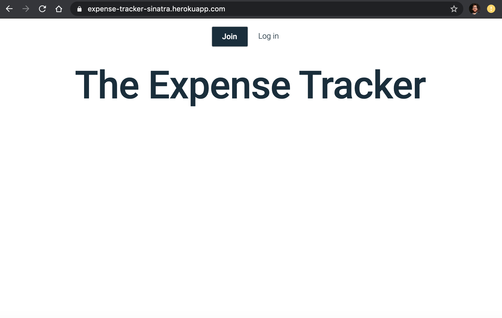

* Click 'Join' to be redirected to the sign up page:

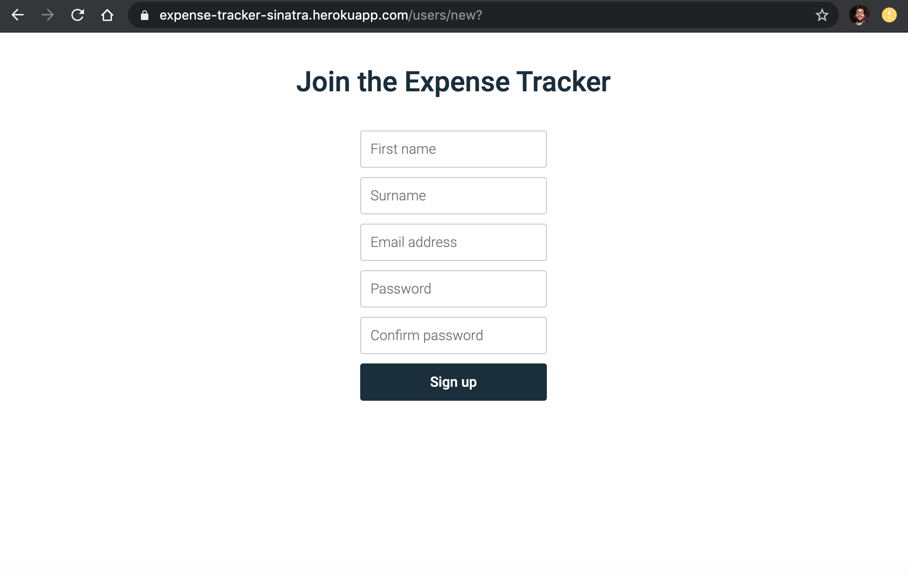

* Enter your details and click 'Sign up' to be redirected to the themes page:

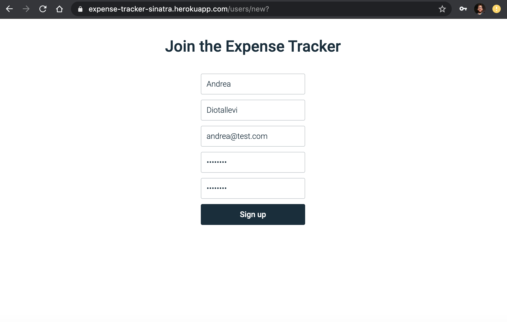

* This is the themes page when you can view all the themes you are member of:

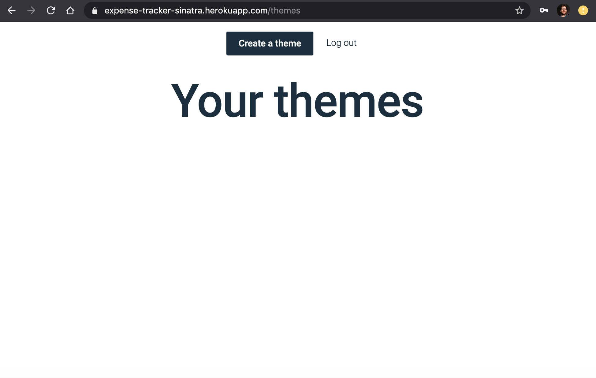

* Click 'Create a theme' to create a new theme:

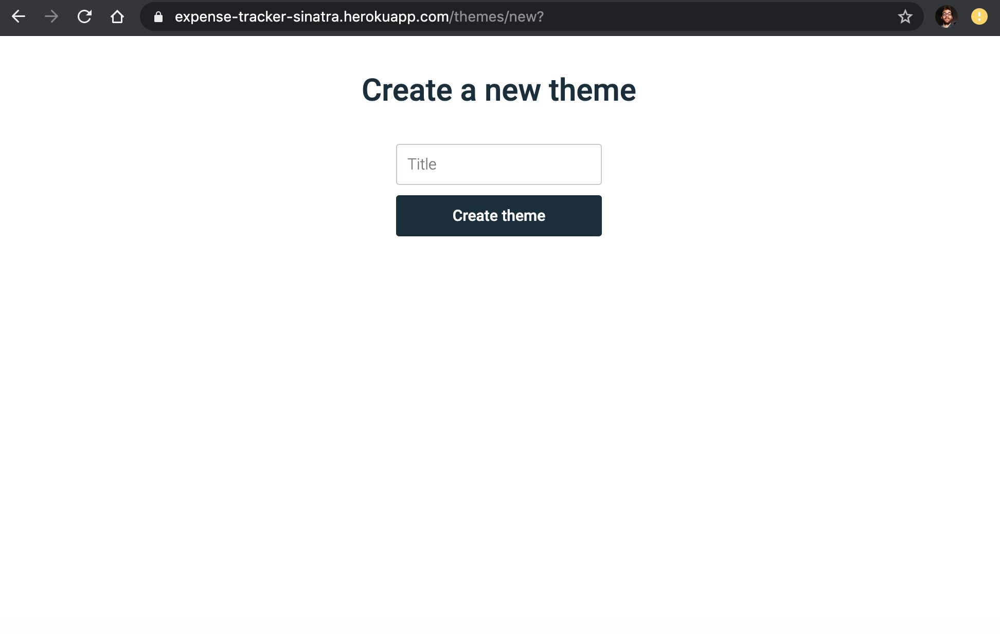

* Enter the name of the theme and click 'Create theme':

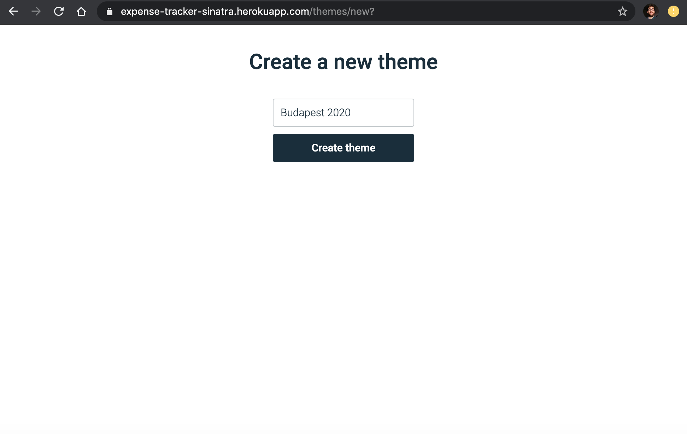

* Now you can view the new theme you have just created:

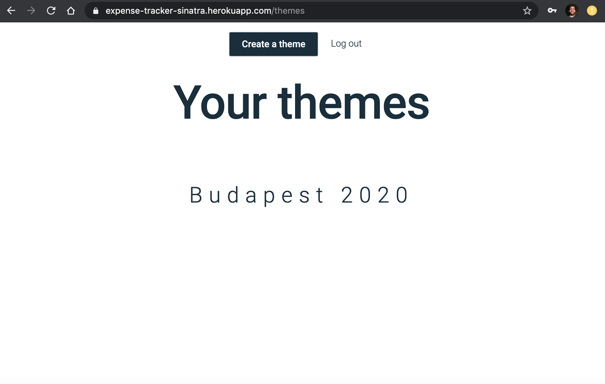

* Click on the theme to be redirected to the theme page:

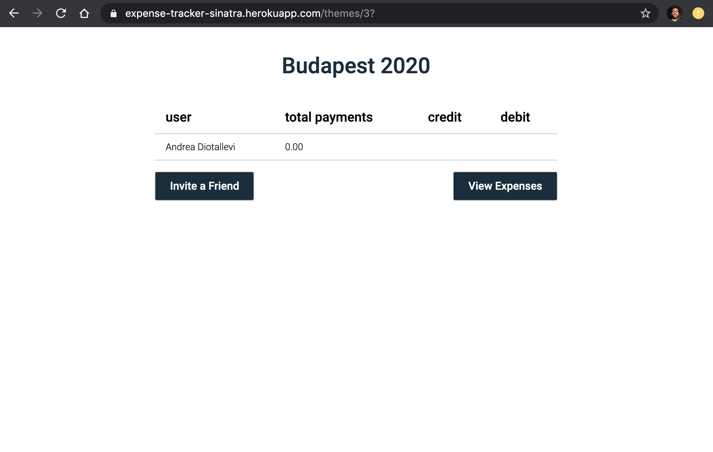

* Click on 'View Expenses' to view all the expenses that have been recorded for this specific theme:

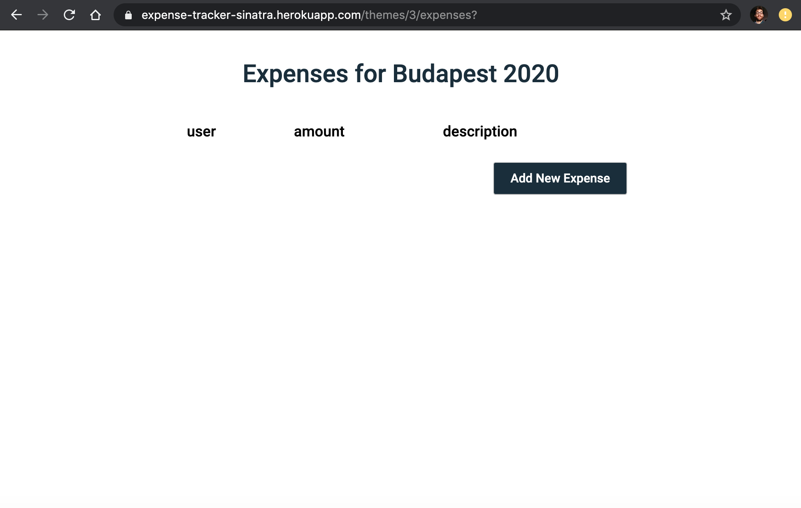

* Click on 'Add New Expense' to add a new expense. In this example we have added three expenses:

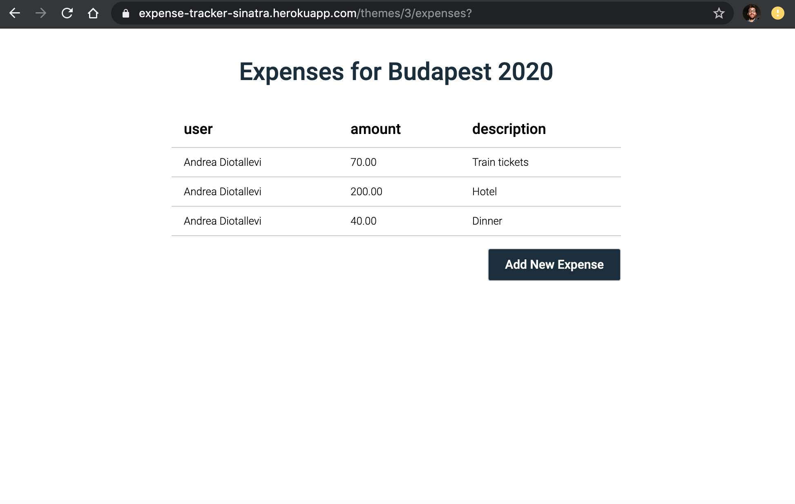

* Click on 'Invite a Friend' to invite a friend to participate to this theme.

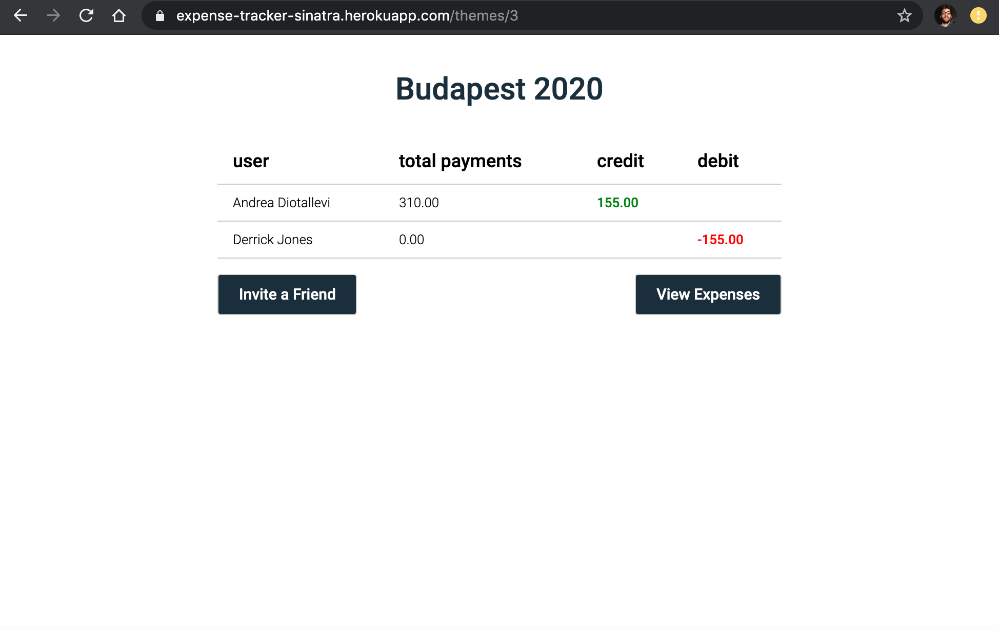

* Click on 'Invite a Friend' to invite another friend to participate to this theme.


* Now, each both users can log in on their accounts and register their expenses:

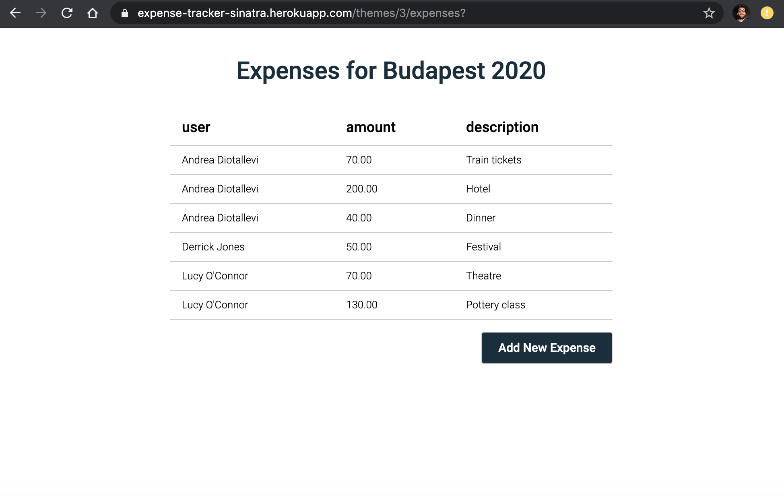

* And on the main theme page, you can view the credit and debit balances for each member of a theme:

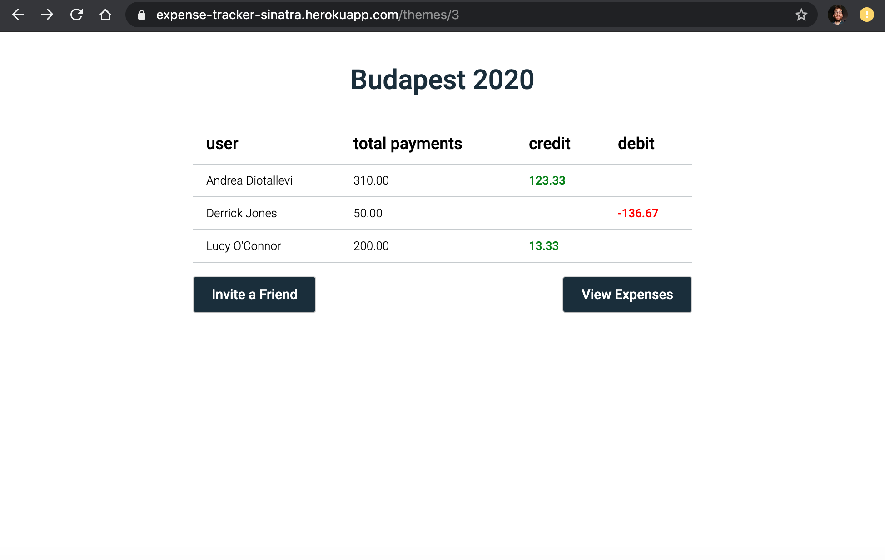

## Getting Started

* Clone this repository with ```git clone git@github.com:AndreaDiotallevi/expense-tracker.git```
* Change into the folder with ```cd expense-tracker```
* Install all the dependencies with ```bundle```
* Install postgreSQL with ```brew install postgresql```
* Make sure you restart the server with ```brew services restart postgresql```

## Database Setup

* Access to the database is controlled by an ORM, ActiveRecord. ActiveRecord rake tasks which are used to migrate the development and test databases. 
* To migrate the development and test databases, please run the following command:
  ```
  $ rake db:create
  ```
* To poplulate the databases with the appropriate tables, run the following migrations:
  ```
  $ rake db:migrate
  $ rake db:migrate RACK_ENV=test
  ```
  
## How to Run the Tests

To run all the test type ```rspec```

## How to Run the App

To start the local server type ```ruby app.rb``` and navigate to ```localhost:4567```

## Technologies Used

- Main technologies:
  - [Ruby](https://www.ruby-lang.org/en/): open source programming language with a focus on simplicity and productivity.
  - [Sinatra](http://sinatrarb.com/): a free and open source software web application library and domain-specific language written in Ruby.
  - [Active Record](https://guides.rubyonrails.org/active_record_basics.html): the M in MVC - the model - which is the layer of the system responsible for representing business data and logic.
  - [BCrypt](https://rubygems.org/gems/bcrypt/versions/3.1.12): a sophisticated and secure hash algorithm designed by The OpenBSD project for hashing passwords.
  - [PG](https://rubygems.org/gems/pg/versions/0.18.4): Ruby interface to the {PostgreSQL RDBMS}.
  - [Rake](https://rubygems.org/gems/rake/versions/11.2.2): tt allows you to use ruby code to define "tasks" that can be run in the command line.
  - [Rubocop](https://rubygems.org/gems/rubocop/versions/0.39.0): automatic Ruby code style checking tool. Aims to enforce the community-driven Ruby Style Guide.
  
- Testing frameworks:
  - [RSpec](https://rspec.info/): testing framework for Ruby.
  - [Capybara](https://rubygems.org/gems/capybara/versions/2.7.1): an integration testing tool for rack based web applications. It simulates how a user would interact with a website.

## Code Quality

To run the linter type ```rubocop```

## Continuous Integration

## Continuous Integration

[TravisCI](https://travis-ci.com/) has been use for continuous integration and automatic deployment to [Heroku](https://dashboard.heroku.com).

## Relational Database Associations

| Users      | Themes | Participations | Expenses    |
| ---------- | ------ | -------------- | ----------- |
| id         | id     | id             | id          |
| first_name | title  | user_id        | user_id     |
| surname    |        | theme_id       | theme_id    |
| email      |        |                | amount      |
| password   |        |                | description |


